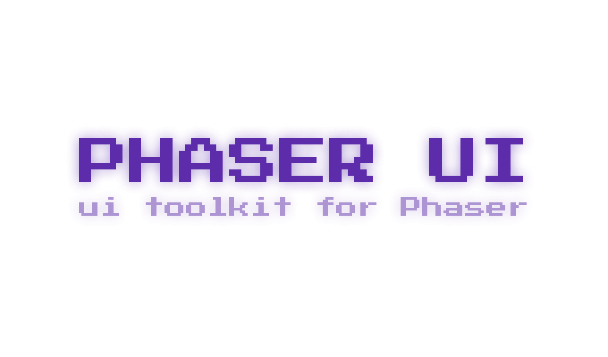

<h1 align="center">
    
</h1>

A UI library for the [Phaser](https://phaser.io/) game framework.

## 🏃‍♂️ Getting Started

After running the following command:

- `npm i phaser-uikit`

You can import all available modules to your project with:

```javascript
import * as UI from 'phaser-uikit'
```

## Components

Currently, the following components are supported:

| Component | Description |
| --------- | ----------- |
| [Button](docs/examples/button.md)     | Trigger a user action |
| [Checkbox](docs/examples/checkbox.md) | Toggle a state on and off, or toggle multiple values from several options |
| [Radio](docs/examples/radio.md)       | Select a single value from several options |
| [Layout](docs/examples/layout.md)     | Order multiple elements into a layout |

## 🚀 How to Start the Project Locally

Run the following commands, to start the project locally and play around with some demo components:

- `git clone https://github.com/flowforfrank/phaser-ui.git`
- `npm i`
- `npm run start`

## 🏗️ How to Build the Project Locally

Run `npm run build`. This will create a `dist` folder with a minified version of all the available components.

## 📚 Further Documentation

You can find documentation about the API and examples for all available components in the [docs](/docs/examples).